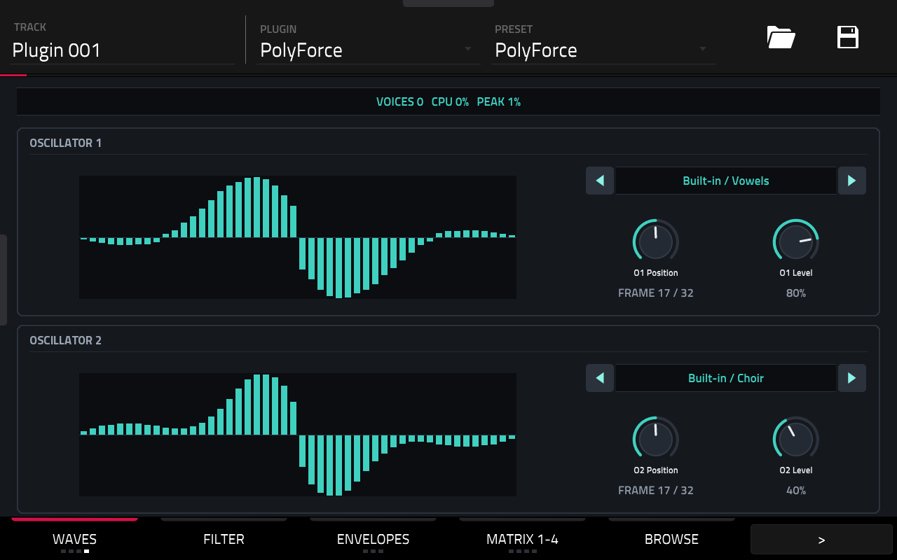

# PolyForce

**A polyphonic wavetable synthesizer that runs natively inside MPC on the Akai Force.**

PolyForce is a VST2 instrument for MPC OS's built-in plugin host, with its own touchscreen pages
and Q-Link sets. Its feature set tips its hat to a certain *buzzing* desktop wavetable synth 🐝,
squeezed into the CPU budget of a standalone groovebox. The name, DSP, wavetables and presets are
all PolyForce's own.



> [!NOTE]
> **Preview.** Milestones 1–7 are complete and pass the full test suite on x86 and under ARM
> emulation. It runs on an Akai Force (MPC OS 3.x): the pages, browser and buttons have been
> checked on the device, a full on-device test round is still to come. The plugin ID (`PlFc`) and
> the file name (`polyforce.so`) stay; the parameter list may still change before v0.1.

## Highlights

- **8 voices** · Poly, Duo, Mono and Legato · four steal modes with click-free fades · glide
- **Two wavetable oscillators** with up to 8× unison, classic waves, sub oscillators and a noise source
- **Two filters** — LP, BP, HP, notch, peak, comb and vowel — serial or parallel, three engine characters
- **Deep modulation** — two LFOs, a 12-slot matrix (28 sources, 36 targets) with modifiers, four XY pads
- **Arpeggiator, 16-step sequencer and four shape sequencers**, locked to MPC's transport
- **30 built-in wavetables** — analog, FM, digital, vocal, acoustic and chip — plus your own
  (Serum-format WAVs and hardware-style tables such as Access Virus TI exports) from the plugin folder or the SSD, with a browser, favorites and recents
- **205 factory presets** in 14 categories, level-matched; user presets, Init and Randomize,
  `.tun` / `.scl` microtuning
- **Built for the Force's CPU** — NEON vectorisation, a profile-guided build, and a CPU guard that
  sheds release tails before the audio drops out

Effects are deliberately left out: use MPC's insert effects on the track.

## Documentation

| Document | What's in it |
|---|---|
| [User guide](docs/USER_GUIDE.md) | The pages, the sound engine, wavetables, presets, tunings, MIDI |
| [Factory content](docs/FACTORY_CONTENT.md) | The 30 built-in wavetables and 205 factory presets |
| [Building](docs/BUILDING.md) | Toolchain, make targets, tests, device bench, packaging |
| [Architecture](docs/ARCHITECTURE.md) | Source layout, threads and real-time rules, saved state |
| [Performance](docs/PERFORMANCE.md) | CPU budget, optimisation passes, measurements, CPU guard |
| [Interface](docs/INTERFACE.md) | Touchscreen design and the skin pipeline |
| [Roadmap](docs/ROADMAP.md) | Milestones, what's next, decisions |
| [Milestone 1 design](docs/M1_DESIGN.md) | Design record: wavetable library, loader, browser |

## Requirements

- An **Akai Force**. Other first-generation (32-bit ARM) MPC OS devices may work but are untested.
- **Root SSH access** to the device (for example through MockbaMod). Stock MPC OS has no way to
  install third-party plugins.
- **MPC OS 3.x** for the touchscreen pages. Release builds need glibc 2.30, so MPC OS 2.x loads them
  too, but it doesn't draw third-party plugin pages yet.

## Installation

Use a release package (`PolyForce-<version>-mpc-armv7.zip`, built by CI: every run of the
[build workflow](.github/workflows/build.yml) keeps one), or build one with `make plugin-package`
(see [Building](docs/BUILDING.md)). Unzip it and follow the `INSTALL.md`
inside. In short:

```sh
scp -r PolyForce-<version> root@<device-ip>:/tmp/
ssh root@<device-ip> sh /tmp/PolyForce-<version>/install.sh
```

The installer **stops MPC** (save your project first), copies the plugin into `/sdcard/Synths`,
backs up and edits `MPC.settings`, and starts MPC again. Running it again upgrades in place and
keeps your own wavetables, presets, tunings and favorites. Then add **PolyForce** to a track from
MPC's instrument plugins.

## Building from source

On Linux or WSL (developed on Ubuntu 24.04):

```sh
make test            # the full test suite under ASan/UBSan
make arm-plugin      # build/arm/polyforce.so for the device
make plugin-package  # dist/PolyForce-<version>-mpc-armv7.zip
```

Toolchain, every make target and the on-device bench are described in
[docs/BUILDING.md](docs/BUILDING.md).

## Status

| Stage | |
|---|---|
| Phase 0 — engine spike: oscillators, filters, WAV import | ✅ |
| Milestone 1 — wavetable library and browsing | ✅ |
| Milestone 2 — voice modes, stealing, glide | ✅ |
| Milestone 3 — subs, classic waves, routing, noise | ✅ |
| Milestone 4 — comb and vowel filters, engines, NEON filters | ✅ |
| Milestone 5 — LFOs, mod matrix, XY pads | ✅ |
| Milestone 6 — arpeggiator, step and shape sequencers | ✅ |
| Milestone 7 — presets, microtuning, interface redesign | ✅ |
| Factory content — 30 built-in wavetables, 205 presets | ✅ |
| Second performance pass — control rate, PGO, CPU guard | ✅ |
| Third performance pass — output stage, 16-bit tables, frame cache | ✅ |
| On a Force: pages, browser, wave view; device bench (11.1% at 8 × 8) | ✅ |
| Release build in CI (glibc 2.31, PGO), passing the plugin catalog's check | ✅ |
| Full on-device test round: Q-Links, project save and reload | 🔜 |
| v0.1 — first release, parameter list frozen | ⬜ |

Details in the [roadmap](docs/ROADMAP.md).

## License

PolyForce is released under the [MIT License](LICENSE). Third-party components keep their own
licenses (below).

## Credits

- Skin generator, previews and installer:
  [sd88me/mpc-vst-plugins](https://github.com/sd88me/mpc-vst-plugins) (MIT), vendored in
  `third_party/mpc-vst-plugins` with a few small, marked patches.
- Interface font: [Titillium Web](https://fonts.google.com/specimen/Titillium+Web), SIL Open
  Font License 1.1 (`surface/fonts/OFL.txt`).

PolyForce is an independent project, not affiliated with or endorsed by Akai Professional /
inMusic or Steinberg. Akai, Force and MPC are trademarks of inMusic Brands; VST is a trademark of
Steinberg Media Technologies GmbH.
