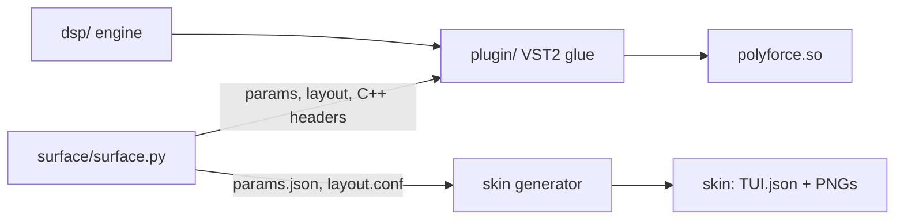
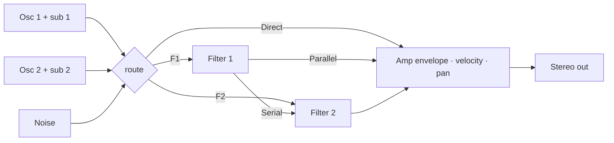

# Architecture

- [Overview](#overview)
- [Source layout](#source-layout)
- [Signal flow](#signal-flow)
- [Threads and real-time rules](#threads-and-real-time-rules)
- [Loading files](#loading-files)
- [Talking to MPC](#talking-to-mpc)
- [Parameters and saved state](#parameters-and-saved-state)

---

## Overview

PolyForce is a single shared object, `polyforce.so`, that MPC loads through its VST2 host, plus a
touchscreen skin generated at build time.

- **`surface/surface.py`** is the single source of the parameter list and the touchscreen pages.
  It writes `params.json`, `layout.conf`, `vst.json`, `build/param_ids.h` (ids, value curves,
  limits) and `build/factory_presets.h` (the factory presets, embedded), after checking the layout
  and every preset (ranges, names, tables).
- **`dsp/`** is the engine: no VST, no files, no threads. It renders a `Patch` for a set of notes.
- **`plugin/`** is everything between the engine and MPC: VST2 entry points, MIDI, parameters,
  the touchscreen logic, file libraries, the loader thread and saved state.

## Source layout

| Path | Contents |
|---|---|
| `surface/surface.py` | Parameter list and touchscreen pages; generates everything the skin and the C++ side need |
| `surface/skin_polish.py` | Redraws knob strips, buttons, stepper arrows and the wave view's bars after the generator |
| `dsp/synth.*` | The engine: voices, oscillators (uint32 phase), sub, noise, Simper SVF, comb and vowel filters, ADSRs, LFOs, the mod matrix; 32-sample control rate with per-chunk glides; four voices per vector in the filters and the output; the frame cache (float copies of positions that hold still) |
| `dsp/wavetable.*` | Band-limited tables (11 mip levels, 2048 down to 256 samples per frame, 16-bit with a scale per frame, FFT-built two frames at a time), the 30 computed built-ins (Classic at load, the rest on first use), the Serum WAV loader |
| `dsp/simd.h` | Four-float vectors: NEON on the Force, SSE on x86, so the tests run the same code |
| `dsp/stages.h` | Per-pass timers for the profiling build (`-DPF_STAGE_TIMING`) |
| `dsp/mod.h` | LFO shapes, sync divisions, mod sources, targets and modifiers |
| `dsp/notegen.*` | Arpeggiator, step sequencer and shape sequencer on a beat clock |
| `dsp/tuning.*` | `.tun` / `.scl` parsing, 128-note pitch tables |
| `plugin/plugin.cpp` | VST2 glue: MIDI with sample offsets, transport, chunk state, denormal flush, CPU meter |
| `plugin/cpu_guard.h` | When to shed release tails (the block's CPU time against its budget) |
| `plugin/surface.*` | The touchscreen side: parameter values, steppers, browser, pushes to MPC |
| `plugin/patch_map.*` | 0..1 ↔ real values, display text, parameters → `Patch` / `SeqPatch` |
| `plugin/library.*` | File libraries (tables, presets, tunings): scan, categories, favorites, recent |
| `plugin/loader.*` | The per-instance loader thread and the shared table cache |
| `plugin/presets.*` | Preset and tuning libraries, user preset files |
| `plugin/state.*` | The state text shared by projects and preset files |
| `plugin/paths.*` | Plugin folder, library roots, data folder, atomic file writes |
| `plugin/vst2.h` | A hand-written slice of the VST2 ABI (no Steinberg SDK) |
| `presets/Factory/` | Factory presets: `NN_Category/NN_Name.pfp`, a folder per browser category, `NN` sets the order, `_` shows as a space |
| `test/` | The test suite (see [Building](BUILDING.md#tests)); `host.h` is a fake MPC host |
| `test/tables_sweep.cpp` | Every WAV in a folder: load, check, play, timing and memory |
| `tools/bench.cpp` | `pfbench`, the CPU bench: `dlopen()`s the `.so` like MPC and times every block |
| `tools/pgo_train.cpp` | The trainer for the profile-guided build (runs under `qemu-arm`) |
| `third_party/mpc-vst-plugins/` | Vendored skin generator and installer (MIT), with marked local patches |

## Signal flow

Per voice:

Each source (oscillator 1 with its sub, oscillator 2 with its sub, noise) has its own route:
filter 1, filter 2, both (`F1+F2`), or `Direct` past the filters. *Serial* / *Parallel* only
decides whether filter 1 feeds filter 2 or sits beside it.

The engine renders in **chunks of 32 samples**, in passes over all sounding voices:

1. **Control:** mod matrix, mod envelope, pitch; values for the chunk
2. **Sources:** oscillators, subs and noise into per-voice buses. The tables are 16-bit; a
   position that holds still plays a float copy of its frame from the per-instance frame cache
3. **Filter 1**, then **filter 2**, four voices per NEON vector, drive as its own pass
4. **Output:** the buses, amp envelope, velocity, pan and a stolen voice's fade, summed four voices
   per vector

Every control value glides across the chunk it applies to instead of stepping. How and why:
[Performance](PERFORMANCE.md).

## Threads and real-time rules

| Thread | Runs |
|---|---|
| **Audio** (one of MPC's audio workers; which one changes between calls, instances run concurrently) | `processReplacing`: MIDI, the engine, the CPU meter, every call back into MPC |
| **UI** (MPC's UI side) | Parameters, display text, saved state (chunks), the browser, preset loads |
| **Loader** (one per instance) | Reading wavetables and tunings, freeing replaced tables |

- Nothing on the audio thread allocates, locks or throws.
- Host callbacks happen only from `processReplacing`; never from `setParameter` or the dispatcher.
- A `try`/`catch` stands between every entry point and MPC: an exception never reaches the host.
- Files load on the instance's loader thread; the audio thread only swaps a pointer.
- Denormals are flushed to zero while a block renders.

## Loading files

A process-wide **library** per file kind (wavetables, presets, tunings) scans its roots (directory
listing only), builds categories, and keeps favorites and recent lists. Items are identified by a
**key** (`plugin:Analog/Saw.wav`, `ssd:…`, `builtin:Classic`), never by index, so adding files
doesn't change saved sounds.

Each instance has a **loader thread** with a slot per oscillator and one for the tuning. It waits
until a selection has been stable for 150 ms (scrolling through 50 tables loads one), loads through
a **shared LRU cache** (96 MB; a table used on both oscillators or in two instances is loaded
once), and publishes it with an atomic pointer swap. Replaced tables are freed only after the audio
thread has finished every block that could still use them (an epoch counter). A missing file falls
back to *Classic* but keeps its key, so it returns when the file does.

The full design: [Milestone 1 design](M1_DESIGN.md), §1–3.

## Talking to MPC

- MPC only notices value changes the plugin makes (lit browser tiles, stepper positions) when they
  are pushed with `audioMasterAutomate`, and only re-reads names and texts after
  `audioMasterUpdateDisplay`. The plugin pushes from `processReplacing` only: at most 48 values per
  block (round-robin), a display update at most every 4 blocks.
- A Force sends every Q-Link detent, data-wheel click or drag event as the value it last read back
  plus its step (sd88me/mpc-vst-plugins `docs/NOTES.md`, "Input probe", MPC OS 3.9.1). Steppers
  measure each event from the plugin's own value and move exactly one item, whatever the delta
  (Q-Link detent 1/128, data wheel 0.01, touch drag, fast spins); MPC echoing the plugin's own value
  back is ignored.
- A tap on a button toggles the value MPC read back, and a button always reads back 0, so every
  tap arrives as a 1 with no release in between: each 1 is a press, and the plugin springs the
  button back to 0 from the next block.
- MPC sends a second toggle about 0.7 s after a tap on a tile; a revert within 1 s is ignored.
- These mechanics were ported from RackForce, an earlier Force plugin. Details:
  [Milestone 1 design](M1_DESIGN.md), §6. To see what MPC sends on a device, see
  [diagnostics](BUILDING.md#diagnostics-on-the-device).

## Parameters and saved state

- **Parameters** are free to change until v0.1, then **append-only**: MPC projects store values by
  index.
- **Saved state** (projects and `.pfp` preset files) is the text format `polyforce 4`: `key=value`
  lines of *real* values (Hz, seconds, dB…) plus the table, tuning and preset keys. Ranges can
  change without remapping saved projects. Versions 1–3 are still read.
- **Limits:** `kMaxVoices` / `kMaxUnison` in `dsp/synth.h` must equal `MAX_VOICES` / `MAX_UNISON`
  in `surface.py`; enum lists in `surface.py` must match the C++ enums. `static_assert`s in
  `patch_map.cpp` check the counts, `test/review_test.cpp` every label against its enum value.
