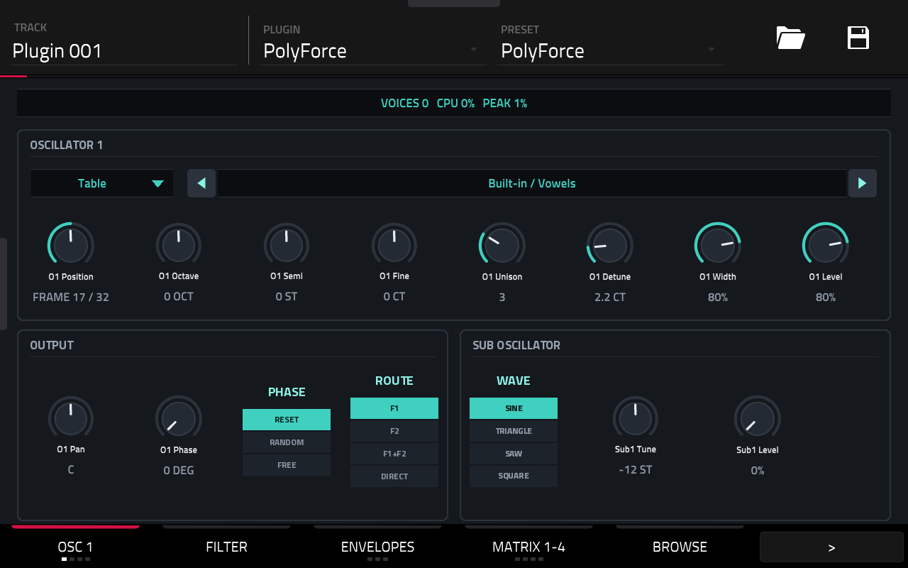
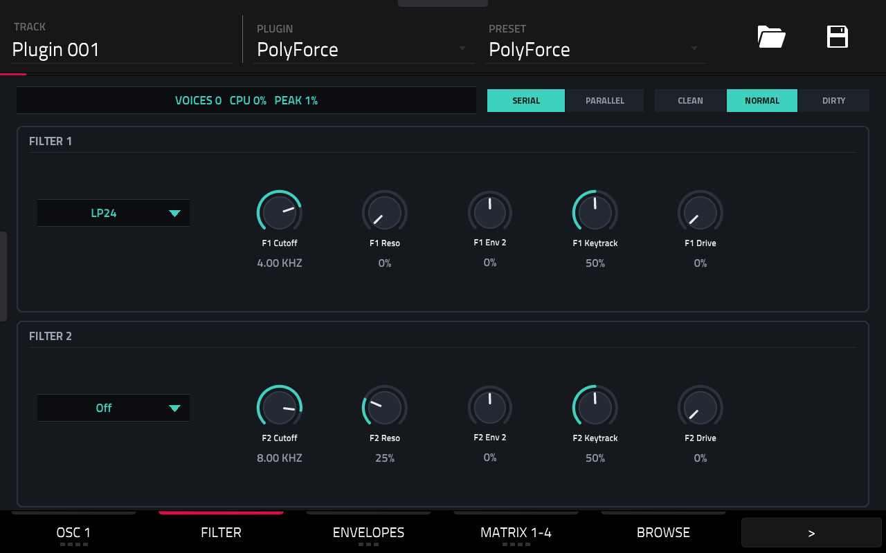
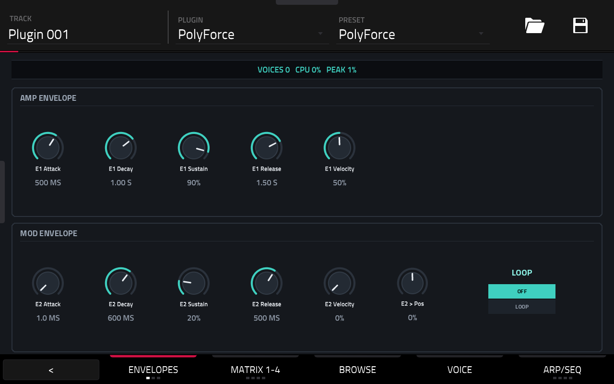
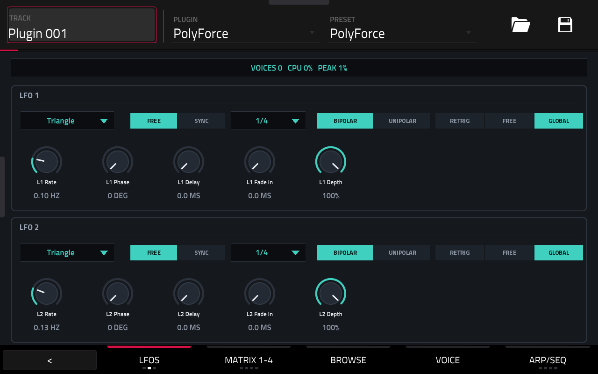
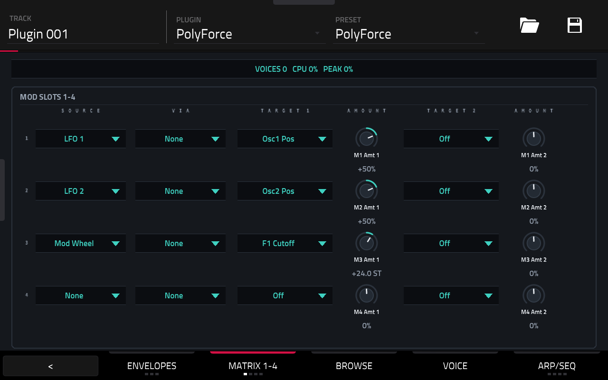
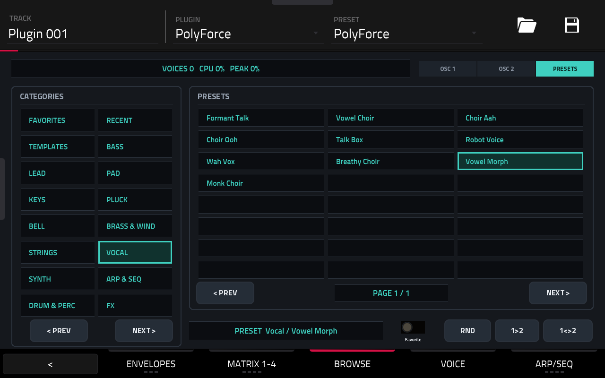
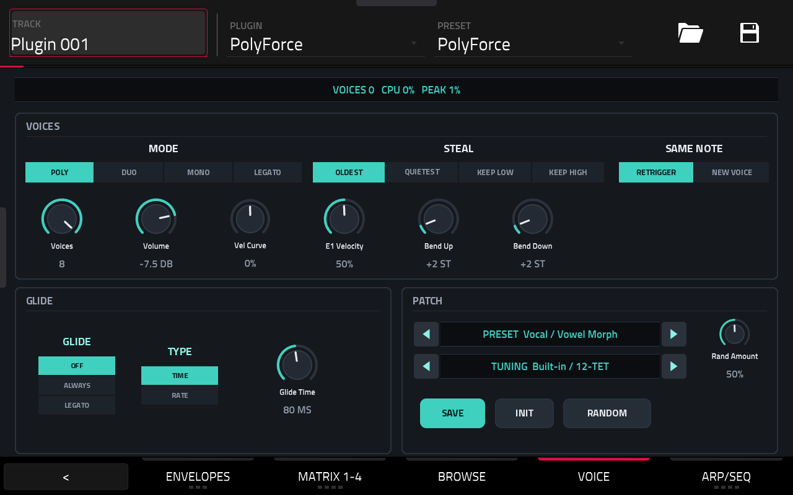
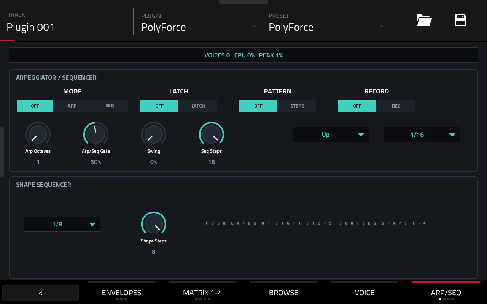

# PolyForce user guide

- [The screen](#the-screen)
- [Sound engine](#sound-engine)
- [Wavetables](#wavetables)
- [Presets](#presets)
- [Tunings](#tunings)
- [Files on the device](#files-on-the-device)
- [Status line](#status-line)
- [MIDI and transport](#midi-and-transport)

---

## The screen

PolyForce has seven tabs in MPC's tab strip. A tab with several pages shows dots under its name:
tap the tab again for the next page. The strip shows the name of the page that is up. Every page
starts with the [status line](#status-line).

| Tab | Pages | What's there |
|---|---|---|
| **OSC** | OSC 1 · OSC 2 · NOISE+MIX · WAVES | One oscillator per page: wave or table, position, tuning, unison, level, pan, phase, route and its sub oscillator. NOISE+MIX: the noise source and a mixer for all levels. WAVES: the [wave view](#wave-view) |
| **FILTER** | FILTER | Both filters: type, cutoff, resonance, env 2 amount, keytrack, drive. Routing and engine sit next to the status line |
| **MOD** | ENVELOPES · LFOS · XY PADS | Amp and mod envelopes · both LFOs · four XY pads with auto-assign |
| **MATRIX** | MATRIX 1-4 · MATRIX 5-8 · MATRIX 9-12 · MODIFIERS | Four slots per page (source, via, two targets with amounts) · the modifier of every slot |
| **BROWSE** | BROWSE | Wavetable or preset browser (OSC 1 · OSC 2 · PRESETS next to the status line): categories, items, favorite, random, copy, swap |
| **VOICE** | VOICE | Voice mode, steal mode, voices, volume, velocity, bend range · glide · preset and tuning, Save, Init, Random |
| **SEQ** | ARP/SEQ · STEPS · SHAPES 1-2 · SHAPES 3-4 | Arpeggiator and sequencer settings · the 16 steps (note, velocity, mod) · the shape-sequencer lanes |

The pages on a Force, with the factory preset *Vocal / Vowel Morph*:

| | |
|---|---|
|  **OSC → OSC 1** |  **OSC → WAVES** |
|  **FILTER** |  **MOD → ENVELOPES** |
|  **MOD → LFOS** |  **MATRIX → MATRIX 1-4** |
|  **BROWSE** |  **VOICE** |
|  **SEQ → ARP/SEQ** | |

### Q-Links

Every page has its own Q-Link set: the knobs follow the page that is up. The Force's eight knobs
show the first eight; the next bank has the rest.

| Page | Q-Links |
|---|---|
| OSC 1, OSC 2 | The eight knobs of the oscillator card · table, pan, phase, phase mode, route, sub wave, sub tune, sub level |
| NOISE+MIX | Noise level, colour, route, both levels and sub levels, volume · sub waves and tunes, pans, routes |
| WAVES | Per oscillator: table, position, level, wave, unison, detune, width, semi |
| FILTER | Filter 1's knobs and type, routing, engine · filter 2's, env 2 attack and decay |
| ENVELOPES · LFOS · XY PADS | The knobs of the page (plus the filters' env amounts and cutoffs on ENVELOPES) |
| MATRIX 1-4 … 9-12 | The four slots' amounts 1 and 2 · their sources and first targets |
| MODIFIERS | The twelve modifier amounts |
| BROWSE | Tables, positions, levels, detunes, preset, tuning, cutoffs and resonances, random amount, volume: scroll and audition while browsing |
| VOICE | The voice knobs, modes, glide, preset, tuning, random amount |
| ARP/SEQ · STEPS · SHAPES | The arp and sequencer settings · the 16 step notes (velocity and mod by touch) · the two lanes' steps |

### Wave view

OSC → WAVES shows each oscillator's current frame (its table at the position knob, morphed between
frames like the oscillator itself) as 48 bars, with the table stepper, position and level beside
it. It follows the knob, not the modulated position, about 20 times a second.

---

## Sound engine

### Voices

- 8 voices; modes **Poly**, **Duo**, **Mono** and **Legato** (Mono and Legato keep a note stack:
  releasing a key returns to the one still held)
- Steal modes: **Oldest**, **Quietest** (released voices first), **Keep low**, **Keep high**; a
  stolen voice fades out over 3 ms, so stealing doesn't click
- Same note again: **Retrigger** or start a **New voice**
- Glide by **Time** or **Rate**, **Always** or only **Legato**
- Pitch-bend range up and down (0–24 semitones), velocity curve, volume (−60 to +6 dB)

### Oscillators (×2)

- **Wave:** Table, Sine, Triangle, Saw, Square, Pulse (position sets the pulse width) or Noise
- **Wavetable position** sweeps the table's frames; its knob reads `FRAME n / N`
- **Unison** up to 8 voices with detune and stereo width
- Octave, semitone and fine tuning; level and pan
- Phase offset with **Reset**, **Random** or **Free** running phase
- **Sub oscillator:** sine, triangle, saw or square, −36 to +12 semitones, own level
- **Route** to filter 1, filter 2, both, or **Direct** (past the filters)

### Noise

A noise source with a continuous colour (dark … white … bright, loudness-compensated) and its own
route.

### Filters (×2)

- Types: Off, LP12, LP24, BP, HP12, HP24, Notch, Peak, Comb+, Comb− and Vowel
  - **Comb:** feedback comb, the cutoff sets its pitch
  - **Vowel:** three formants; the cutoff morphs A–E–I–O–U
- Cutoff, resonance, drive, keytrack and mod envelope amount
- **Routing:** Serial (filter 1 feeds filter 2) or Parallel. Each source's route decides which
  filter(s) it enters.
- **Engine:** Clean (no drift, linear), Normal, or Dirty (analog drift, saturation inside the
  filter loop)

### Envelopes

- **Amp envelope** (ADSR) with velocity amount
- **Mod envelope** (ADSR) with velocity amount, loop, and direct amounts to both cutoffs and to the
  wavetable position

### LFOs (×2)

- Shapes: Sine, Triangle, Saw Up, Saw Down, Square, S&H, Smooth
- Free (0.02–40 Hz) or synced to MPC's tempo (17 divisions, 8 bars to 1/32T)
- Phase, delay, fade-in, depth; Bipolar or Unipolar
- Trigger: **Retrig** (per voice, restarts on every note), **Free** (per voice, never restarted)
  or **Global** (one LFO for all voices; when synced, locked to MPC's bar position)

### Modulation matrix

12 slots, each with:

- a **source** and two **targets** with their own amounts
- a **via** source that scales the amount (e.g. LFO depth by mod wheel)
- a **modifier** with an amount: Curve, Rectify, Quantize, S&H or Slew

**28 sources:** both envelopes, both LFOs, velocity, note, mod wheel, aftertouch (channel and
poly), pitch bend, random, alternate, gate, the step sequencer's mod lane, four shape sequencers,
four XY pads (X and Y), breath, expression and a constant.

**36 targets:** global pitch; per oscillator pitch, position, level, pan and detune; both sub
levels; noise level and colour; each cutoff and both together, resonance and drive; every stage of
both envelopes; LFO rate and depth; volume and pan.

### XY pads

Four XY pads, eight knobs that sit well on the Q-Links. **AUTO-ASSIGN** puts every pad that isn't
used yet into a free matrix slot.

### Arpeggiator and sequencers

**Mode** on SEQ → ARP: Off, Arp or Seq.

- **Arpeggiator:** Up, Down, Up/Down, Down/Up, Played, Random or Chord; 1–4 octaves; latch;
  optional step **pattern** (the step sequencer's rests, velocities and transpositions)
- **16-step sequencer:** note (transposed from the held key), velocity and a mod lane that is also
  a matrix source; **RECORD** enters steps from the keys
- **Shape sequencer:** four lanes of eight steps (Step, Ramp or Smooth) as matrix sources
  Shape 1–4, with their own rate
- Rate, gate and swing; locked to MPC's transport while it plays

### Effects

None, on purpose: MPC's insert effects follow the plugin on its track. The filter drive is part of
the voice and stays.

---

## Wavetables

### Format

WAV files with single-cycle frames back to back, mono (or the first channel), 32/64-bit float or
8/16/24/32-bit PCM, up to 256 frames. A table is normalised as a whole, so level changes across
its frames are kept.

- **Serum tables**: 2048 samples per frame, or the frame size given in the `clm ` chunk.
- **Hardware tables** (Access Virus TI, Waldorf, PPG and similar exports): usually 256, 512 or 1024
  samples per frame and no `clm ` chunk. PolyForce works the frame size out from the file
  (neighbouring frames of a morphing table are nearly alike).
- **Saying it yourself**: if a table sounds wrong (an octave or more too high or low, buzzy, too few
  or too many frames), put the frame size in square brackets into the file name or its folder name:
  `Virus Saw Stack [256].wav`, or a whole folder `Wavetables/Virus TI [256]/`. This wins over the
  `clm ` chunk and the automatic detection. Any power of two from 64 to 16384 works.

### Where to put them

| Root | Path |
|---|---|
| Plugin folder | `/sdcard/Synths/Devko - VST - PolyForce/Wavetables` |
| SSD | `/media/AkaiForce/Wavetables` (skipped when no drive is mounted) |

- The first folder level is the **category**; files directly in a root go to *Unsorted*. Same-named
  categories from both roots merge.
- A name prefix shared by every file in a category (ending in `" - "`) is hidden:
  `ESW Analog - Jupiter 8 Saw` shows as `Jupiter 8 Saw`.
- **30 tables are built in** (category *Built-in*): analog, FM, digital, vocal, acoustic and chip
  shapes, all computed. *Classic* is ready when the plugin loads; the others are built the first time
  a sound uses one (a moment of `LOADING`). The list, with tips:
  [Factory content](FACTORY_CONTENT.md#built-in-wavetables).

### Picking a table

- **Stepper** on OSC 1 / OSC 2 (and WAVES): moves exactly one table per turn of a knob, Q-Link or
  data wheel, through all tables in category order.
- **BROWSE**, with OSC 1 or OSC 2 selected: tap a category on the left, then a table. **★** marks
  the table as a favorite, **RND** loads a random table from the category, **1>2** copies
  oscillator 1's table to oscillator 2, **1<>2** swaps them. *★ Favorites* and *Recent* (the last
  12) are categories of their own.

Tables load in the background while the sound keeps playing (status line: `LOADING`). Projects
store the table by name, not by number, so adding files never changes a saved sound. If a file is
gone, the oscillator falls back to *Classic*, shows `MISSING`, and keeps the reference: save the
project and the table comes back once the file does.

---

## Presets

- **205 factory presets** in 14 categories (Templates, Bass, Lead, Pad, Keys, Pluck, Bell, Brass &
  Wind, Strings, Vocal, Synth, Arp & Seq, Drum & Perc, FX), built into the plugin and level-matched.
  The list: [Factory content](FACTORY_CONTENT.md#factory-presets).
- **SAVE** (VOICE tab) writes the current sound to `Presets/User/User NNN.pfp` in the plugin folder.
  MPC has no text entry, so presets are numbered; rename the files on a computer if you like.
  Numbers are never reused.
- **INIT** loads the init patch. **RANDOM** randomizes the sound by the amount next to it; volume
  and voicing stay untouched and attacks stay playable.
- Browse them with the **PRESET** stepper on the VOICE tab, or on BROWSE → PRESETS (categories,
  favorites, recent, random).

Preset roots: `Presets` in the plugin folder and `/media/AkaiForce/PolyForce Presets` on the SSD;
categories work as for wavetables. A folder of your own named like a factory category lists next to
it as "Bass (files)" and so on.

---

## Tunings

Microtuning from Scala `.scl` and AnaMark `.tun` files in `Tunings` in the plugin folder or
`/media/AkaiForce/Tunings`. Pick one with the **TUNING** stepper on the VOICE tab. The tuning is
saved with the project and with presets.

---

## Files on the device

The plugin folder is `/sdcard/Synths/Devko - VST - PolyForce`. Where a kind of file has two roots,
the first is where PolyForce saves.

| What | Where |
|---|---|
| Wavetables `*.wav` | `<plugin folder>/Wavetables`, `/media/AkaiForce/Wavetables` |
| Presets `*.pfp` | `<plugin folder>/Presets` (saved presets go to `User/`), `/media/AkaiForce/PolyForce Presets` |
| Tunings `*.tun`, `*.scl` | `<plugin folder>/Tunings`, `/media/AkaiForce/Tunings` |
| Favorites and recent lists | `<plugin folder>/*.txt` |

The installer keeps all of these when you upgrade or reinstall.

---

## Status line

| Shows | Meaning |
|---|---|
| `VOICES 6   CPU 9%   PEAK 14%` | Sounding voices; this instance's CPU use as a share of MPC's audio budget, average and peak |
| `GUARD n` | The CPU guard has faded out *n* release tails to keep the audio from dropping out |
| `OSC 1 LOADING <table>` | A table is loading in the background |
| `OSC 1 MISSING <table>` | The file wasn't found; *Classic* plays instead (shown for 5 s, then in the stepper) |
| `TUNING LOADING` / `TUNING MISSING` | The same for tuning files |

**CPU guard:** when an instance runs over budget, PolyForce fades out the quietest voices that are
only ringing out (release tails). Held and sustained notes are never touched. Details in
[Performance](PERFORMANCE.md#cpu-guard).

---

## MIDI and transport

| Message | Effect |
|---|---|
| Notes | Play voices, or feed the arpeggiator / sequencer when its mode is on |
| Sustain (CC 64) | Sustains notes; in Arp / Seq mode it holds the keys |
| Mod wheel (CC 1), breath (CC 2), expression (CC 11) | Matrix sources |
| Channel and poly aftertouch | Matrix source *Aftertouch* |
| Pitch bend | Pitch, within the bend range; also a matrix source |
| All Sound Off (CC 120) | Silences every voice at once |
| All Notes Off (CC 123) | Releases every note |

MPC's tempo drives synced LFOs, the arpeggiator and the sequencers; while MPC's transport plays
they lock to its song position.
